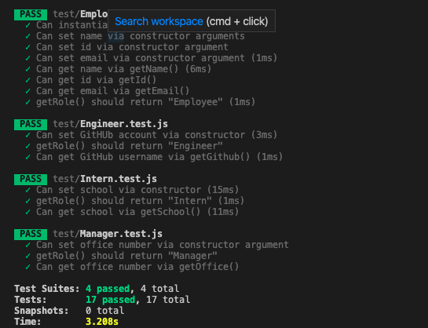

# template-engine

## Project Description
This is a software engineering team generator command line application. The application prompt the user for information about the team manager and then information about the team members. The user can input any number of team members, and they may be a mix of engineers and interns. When the user has completed building the team, the application will create an HTML file that displays a nicely formatted team roster based on the information provided by the user.

## How to generate an HTML file

To generate the HTMl file simply clone this repository, navigate via the terminal to the directory where app.js file is and run the command
```
 node app.js
```
then you will be prompted to answear a list of questions related to your team.

To view the generated file  navigate to the ```output``` directory then open the team.html file via a browser.

## Demo 

## End result


## How to test
There are unit test provided in the ```test``` directory. To run test go to the root directory via the terminal and run the next command.

``` npm run test```

## Test Results


## Technologies Used
- JavaScript
- Node and NPM
- Inquirer package
- FileSystems
- HTML
- CSS
- Bootstrap

